# circuits
Logic Circuits using Logisim

## [voting.circ](./voting.circ)
Voting combinational circuit.
[full-counter](./full-counter.png)

## [counter.circ](./counter.circ)
Counter circuit with Flip-Flop D.
[full-voting](./full-voting.png)

## Controller

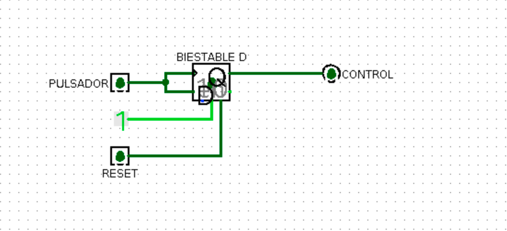

## Timer

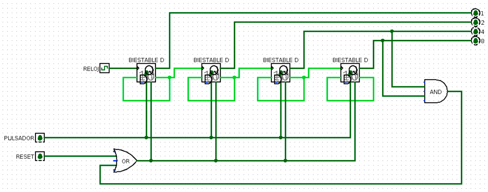

## Semaphore

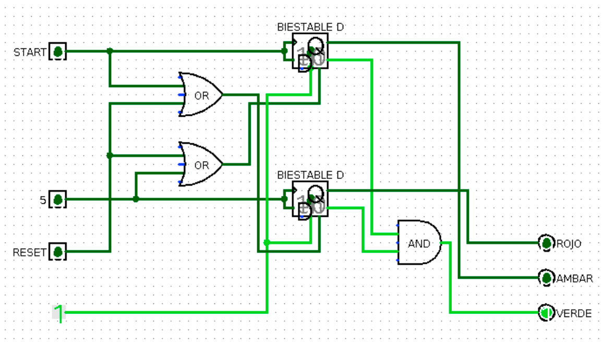

## Adder

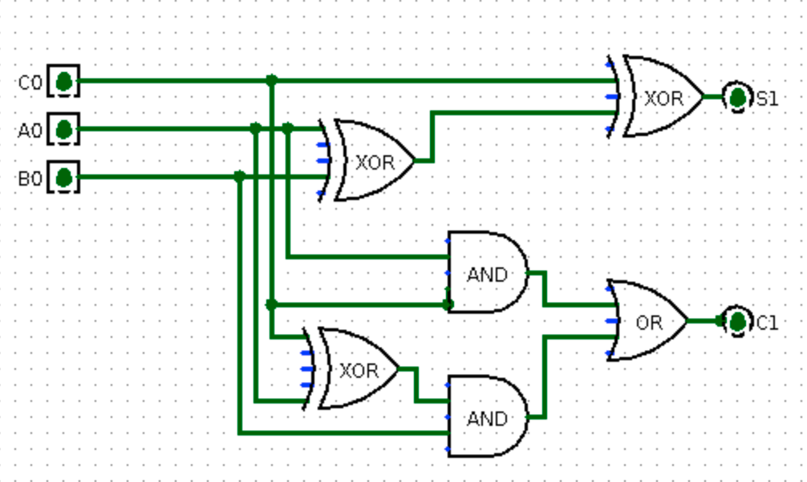
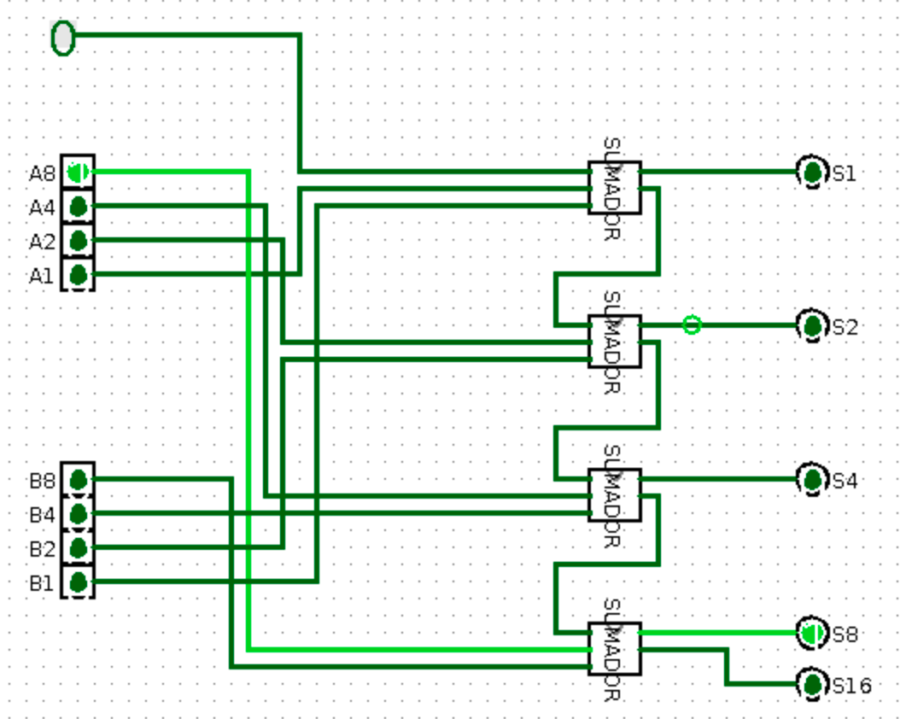

## Inverter

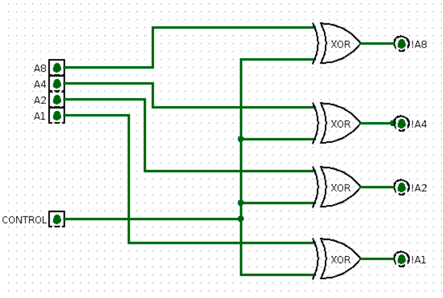

## Substractor

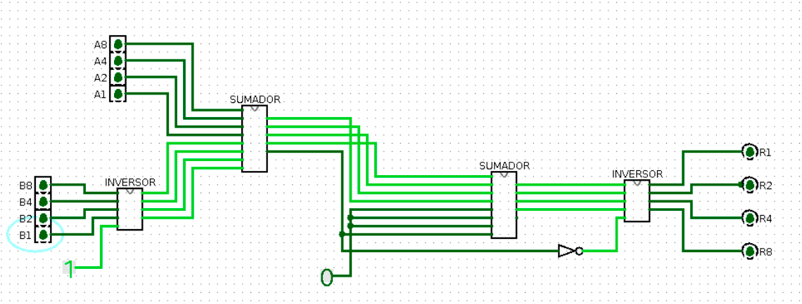

## Decoder

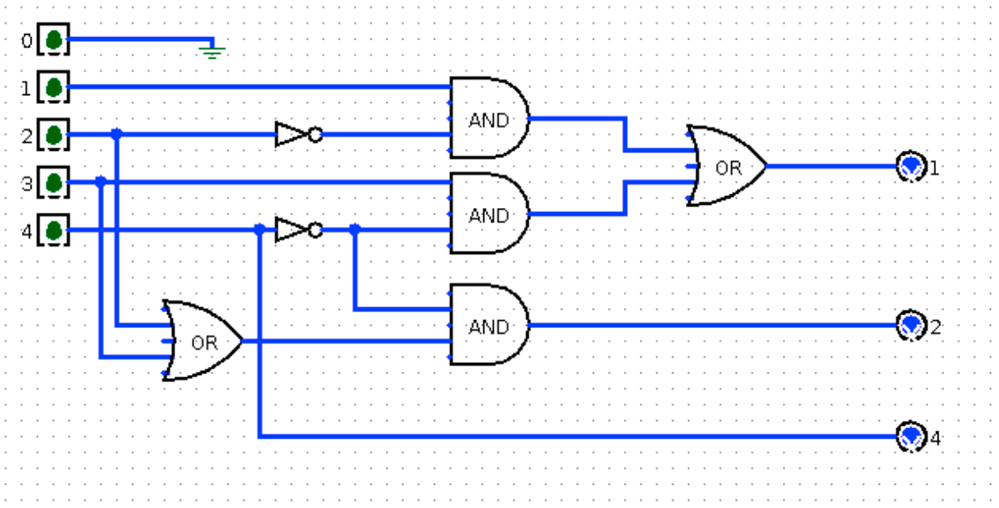
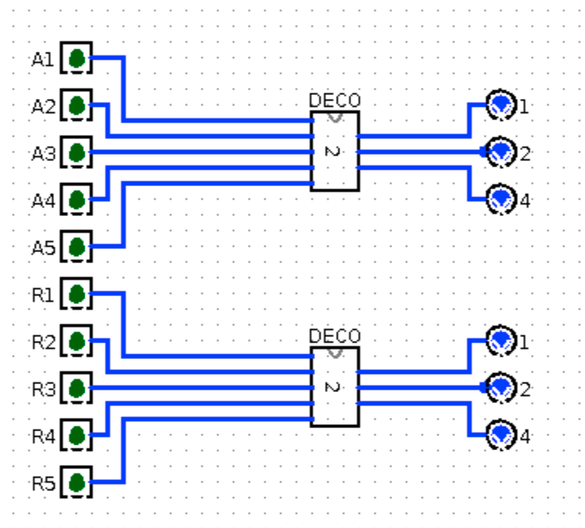

## Comparer

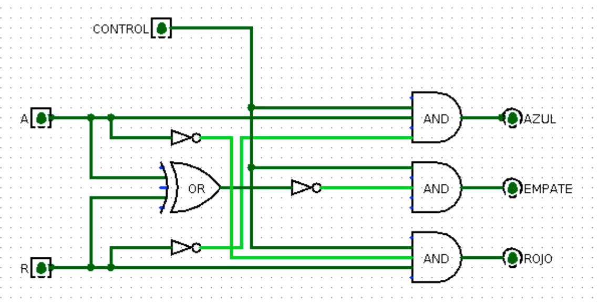
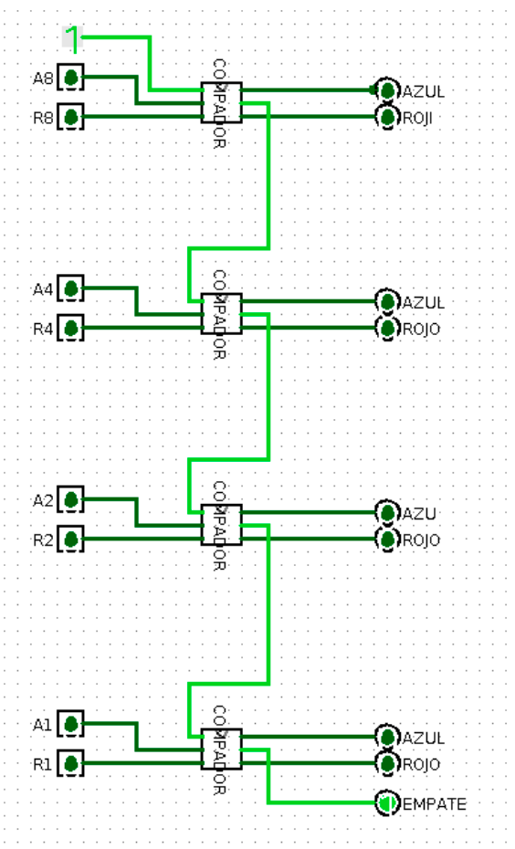

## Decoder

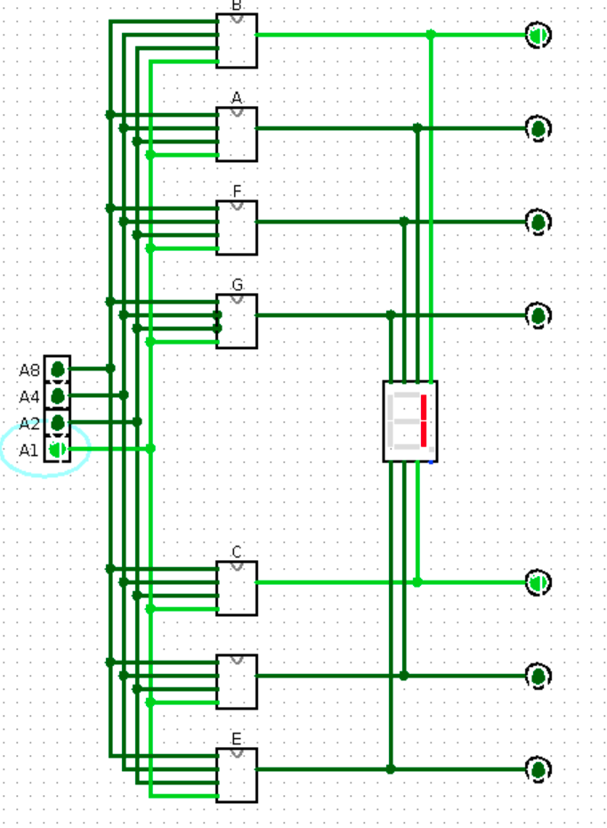
