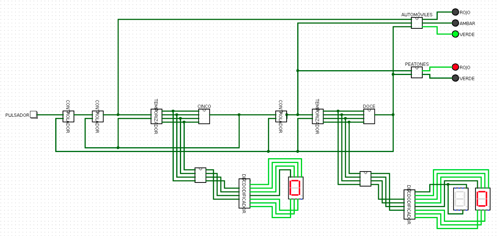
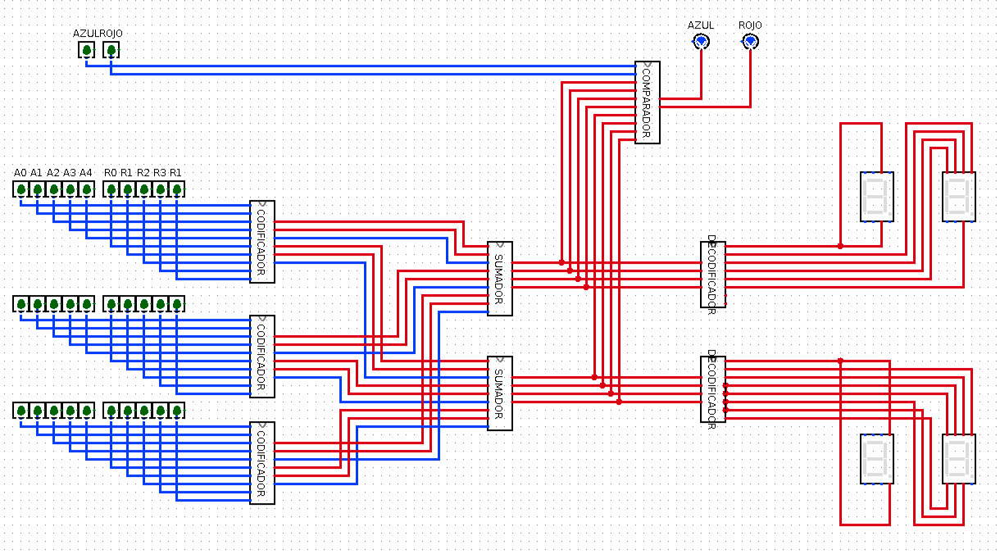
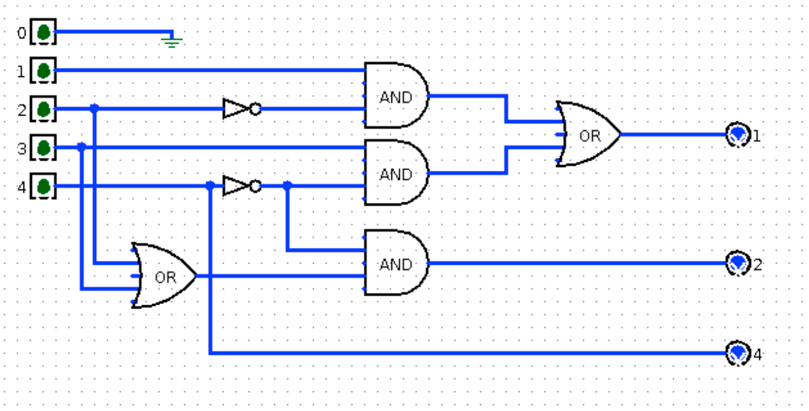
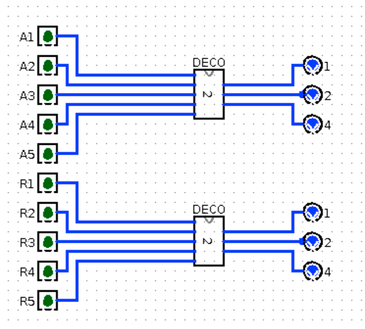
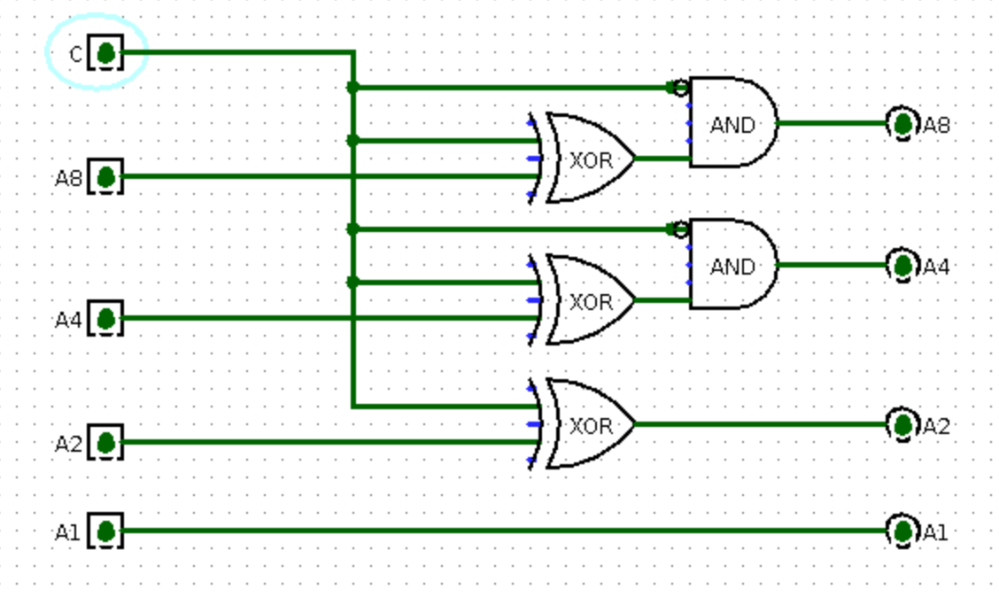

# circuits
Logic Circuits using Logisim

## Full Circuits

### [voting.circ](./voting.circ)
Voting combinational circuit.

### [counter.circ](./counter.circ)
Counter circuit with Flip-Flop D.

## Subcircuits

### Controller
Circuit responsible for storing User input.

### Timer
Circuit responsible for counting to 16.

### Semaphore
Circuit responsible for displaying 3 LED lights.

### Adder
Circuit responsible for summing two 4-bits numbers.

### Inverter
Circuit responsible for inverting the input.

### Substractor
Circuit responsible for substracting two 4-bits numbers.

### Encoder
Circuit responsible for transforming User input into 4-bits.

### Comparer
Circuit responsible for comparing two 4-bits numbers.

### Decoder
Circuit responsible for transforming a 4-bits number into BCD.

### Rectifier
Circuit responsible for rectifying 4-bits.

